# Budding GDB toolset

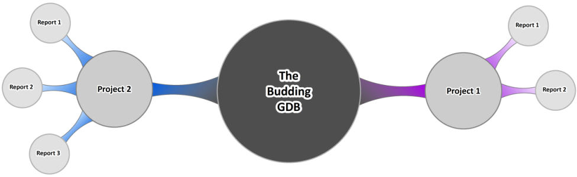

#### Table of Contents:
 - [Description](https://github.com/SethDocherty/Budding-GDB#description)
 - [Conceptual Overview](https://github.com/SethDocherty/Budding-GDB#conceptual-overview)
 - [ETL Toolset Overview](https://github.com/SethDocherty/Budding-GDB#etl-toolset-overview)
 - [Creating Maps with Report Specific Feature Classes](https://github.com/SethDocherty/Budding-GDB#creating-maps-with-report-specific-feature-classes)
 - [Setting up the Initial Data Structure](https://github.com/SethDocherty/Budding-GDB#setting-up-the-initial-data-structure)
 - [Creating the Initial Figures for a Report](https://github.com/SethDocherty/Budding-GDB#creating-the-initial-figures-for-a-report)
 - [Installation and Other Files](https://github.com/SethDocherty/Budding-GDB#installation-and-other-files)

## Description:

The Budding Geo-Database (GDB) is a data model designed for creating report maps. Instead if storing all your project specific data 
in a single GDB, projects are containerized to their own GDB.

A set of ETL (Extract->Transform->Load) tools emulate a one-way replication system to keep a child geo-database (GDB) synced 
to the parent GDB in a disconnected environment.

#### Purpose:

As a GIS specialist, one of your main duties is to create maps.  They could be figures for a report or for some kind of flyer/handout. That first map you create may go through 1, 2, 3+ revisions and each map may
have to be completely re-created due to changes in the area of focus or a change in change label properties. If you constantly find yourself in this position, then this data model may help you!

Creating maps can be quite a laborious process and re-creating maps due to revisions is unwanted lost time that can be best spent on other tasks.  The majority
of requested revisions are due to changes in the area of focus in the map or changing the label properties.   

The two key patterns that come from most revisions are:
 - *Extent* of the data frame in the figure will dictate the size of the label and the placement.
 - *Attributes* from the feature class getting labeled dictate the annotation properties.

## Conceptual Overview

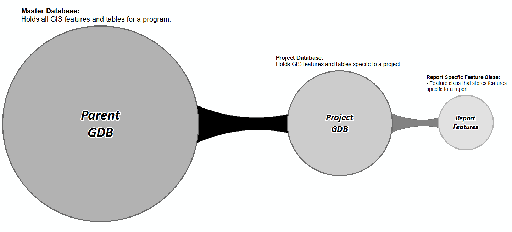

1. All projects branch off a single parent GDB.
2. A project GDB stores all the features related to a project.
3. Each project GDB contains project specific report features.
4. Replicated features from a Parent GDB are stored in a report specific feature class.
	- Uses the schema from the parent GDB.
	- Report Feature class stored in project GDB.
	
#### Data Structure Strengths

 - Replicated features are tied to a figure.
	- Know exactly what features are in each figure.
 - Users are able to work in a disconnected environment.
	- Greater flexibility to meet a projects specific needs.
	- Enhances productivity, especially in an ever-changing environment.
 - ETL toolset enables easy updates to figures.
 - Easily setup project data structure.
 - Built-in ArcGIS tools optimize figure creation.
  
#### Data Structure Limitations

 - One-way replication means that edits to replicated features must happen at the parent level.
	- Changes will trickle down to the child with the ETL tools.
 - Features to be replicated must contain a unique ID field.
	- Cannot be a field such as an OID.
 - ETL toolset checks for difference in the parent/child attribute data.
 - Not meant for an enterprise SDE replacement.
 - ETL toolset relies on arcpy.
 
#### Design Features

When I was developing this concept, these are some of the design features I came up with:

- Replicated report features inherit attributes from the figure extent.
	- The key attributes needed are the scale and figure/area name.
- Figure extents spatially store the scale of the figure.
	- The extent is based on the data frame in layout view.  Different figure sizes will have different spatial extents i.e. 11x17 has a smaller extent footprint compared to ANSI E.
- If a replicated report feature class uses feature linked annotation, the font size is based on the scale and the label properties are based on report specific attributes.
- Data Driven Pages can generate multiple figures for a report.
	- The figure extent would be used as the index layer and the scale field from the layer maintains the extent.
- Data structure is scalable to quickly automate the process of creating figures.

## ETL Toolset Overview:

In order to keep a child GDB synced with a parent GDB, a set of ETL tools (written in python) found [here](./Budding_GDB_toolset/Install/Toolbox/bin) have been created to:
  - Replicate features of interest from the parent GDB.
  - Update attributes of the replicated features stored in a child GDB so they match the attributes of the parent feature.
  - Update tables stored in the child GDB with new features from a database query.
  
#### Add New Geometry

This script will add new features to a feature class, specifically features that are in the parent and not in the report feature class.

Instead of immediately adding features to the report feature class, I've opted to store new features to a temporary feature class and have the user append the new features after verification.

Some built in features with the script:
 - The ability to add features to a specific figure.
 - Filter out specific attributes.
	- for example, maybe you don't want monitoring wells or type of parcel in the final report figures.

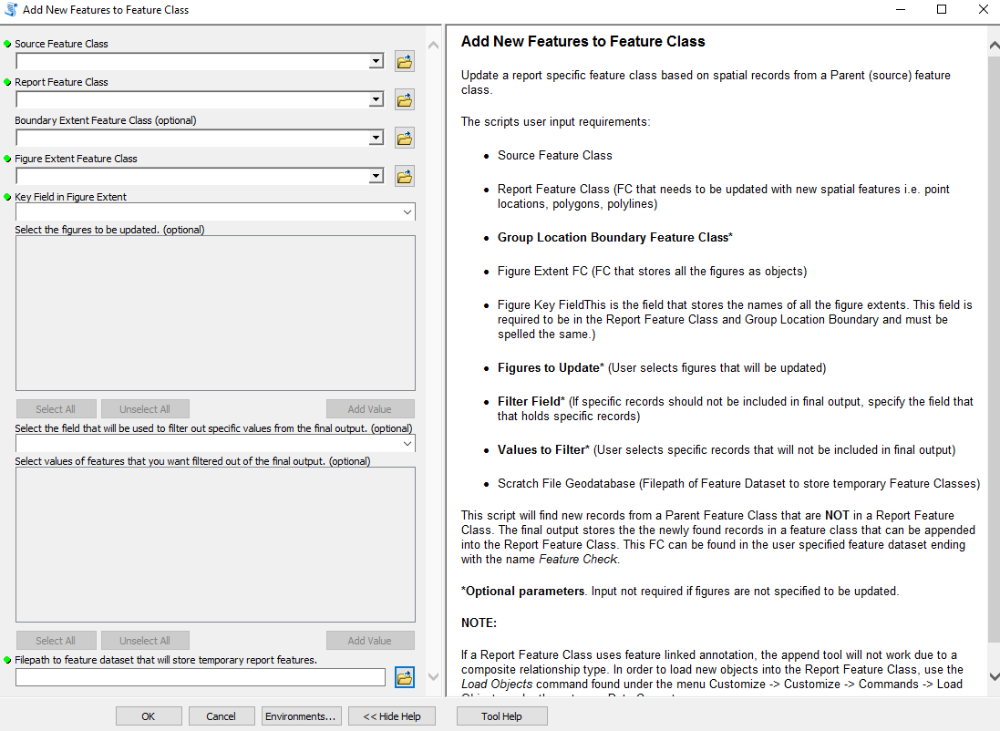

#### Update Attributes

The purpose of this script is to update the attributes of a target feature class with the attributes of a source feature class.  This would be used to keep a report feature class
attributes up to date so it matches the parent feature class.

Some built in features with the script:
 - The ability to update attributes for a specific figure.
 - Select a set of fields to update in the target feature class.
 - The ability to update attributes from a table, feature class, or .csv document.

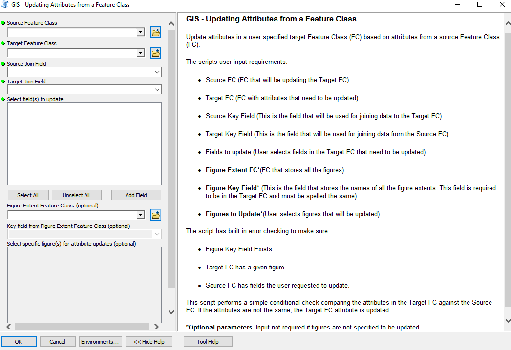
 
#### Add New Records

This script will add new records from a database query.  You may need to add data to an ArcMap table which comes from a data dump from a database query.  If you need to add 
new data that is not already in the ArcMap table, you would need to compare the two datasets which is not an easy feat.

There are no strict requirements for the input .csv document:
 - Field order does not need to match the ArcMap table.
 - The fields in the ArcMap table must be in the .csv document and spelled the same.
	- Even fields that are not in an ArcMap table can be in the csv document.  The ETL script will take care of the uncessary fields.

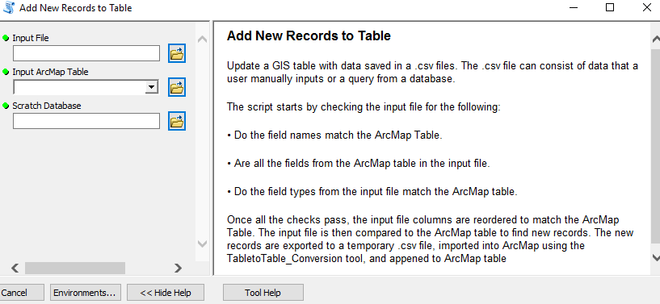
 
## Creating Maps with Report Specific Feature Classes

In order to bring the concept to life, you will need to create a few feature classes and populate them with the necessary features.  All the report specific GIS
layers should be stored in their corresponding project GDB. All the report feature classes should be named after the report in question for the ease of data management. 

What are the report specific features classes?

#### Required Feature Classes:
 - Replicated layer of interest from parent GDB
	- This is the GIS layer that will be in focus in most of the figures i.e. a sample location from a contaminated site or a parcel.
	- Replicated layer MUST have a field which stores unique ID's.
 - Figure Extent
	- Stores the spatial extent of the data frame.
	- Two key attribute fields: Figure Scale size and the name of the figure/Area.

#### Optional Feature Classes:
 - Boundary Extent
	- This is an optional layer that can be used to spatially filter out features.
 - Feature Linked Annotation
	- This is an optional layer that can be created.  Highly recommended to take an advantage of precise label placement and control
	  the label color with feature attributes.

## Setting up the Initial Data Structure
	
#### Setting up the Project Containers

You will need to create two file-geodatabase (FGDB) to store all your project data.
 - Project Database:
	- Stores all your project specific feature classes.
	- Data can be organized into themes by using feature datasets.
 - Scratch Database
	- This contains temporary features that are created from the ETL scripts.
	- The find new features script does not immediately append data.
	- A Feature Dataset is required when running the [add new geometry](https://github.com/SethDocherty/Budding-GDB/#add-new-geometry) tool.  It's recommended that its named after the report name for ease of data management

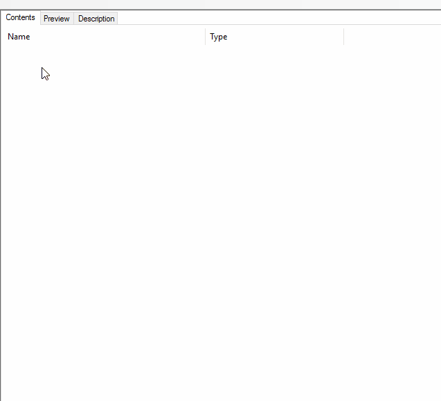

#### Creating the Figure Extent Feature Class

The figure extent is the extent of the data frame in layout mode.  This feature class is also used to extract features.  Any features from the GIS layer getting replicated that intersect the spatial 
footprint, will be tied to the figure using a one-to-many spatial join. The two field requirements for this feature class are:
 - Scale
 - Figure/Area Name
 
Those two attributes are necessary (does not have to be those names) as the replicated GIS layer will inherit the values from those fields when running the ETL tools.

Using the extent to polygon add-in (found in my [repository](./Useful tools)) you can easily extract the footprint of the reference frame. Keep in mind, when the figure size changes, the footprint
size of the data frame will change.

#### Report Specific Feature Class

This feature class stores the replicated feature(s) from parent GDB Feature.  To create this feature class:
 - Import schema from GIS layer in the parent GDB.
 - Must contain the fields scale and figure/area name. 
	- The field names must be the same as the fields used in the figure extent feature class.
 - Add in any additional fields that are specific to the report and/or project.	

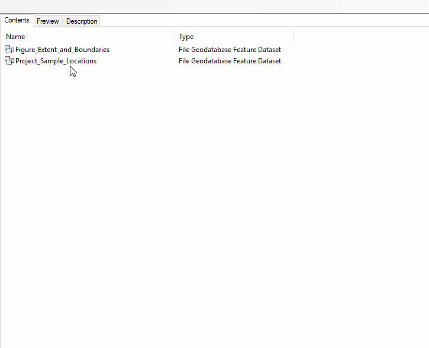

#### Boundary Extent Feature Class

This feature class stores the boundaries of specific areas of interest in each figure.  This can be used in cases where features within a boundary are needed in the 
figure. A useful application for a boundary extent is to only show sample locations within contamination plume; samples that do not intersect the plume are not shown in 
the figure. This is an entirely optional feature class that is not required.

Requirements:
 - Must contain the and figure/area name. 
	- The field names must be the same as the fields used in the figure extent feature class.
	
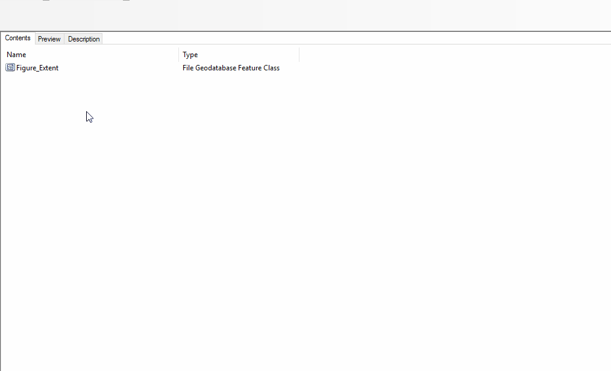

## Creating the Initial Figures for a Report

Now that your project database has been created and along with the empty report specific features classes, let’s start creating the first set of figures. It's assumed we have already developed our report figure layout.  This is key
since the figure extent is based on the spatial footprint of the data frame in layout mode.

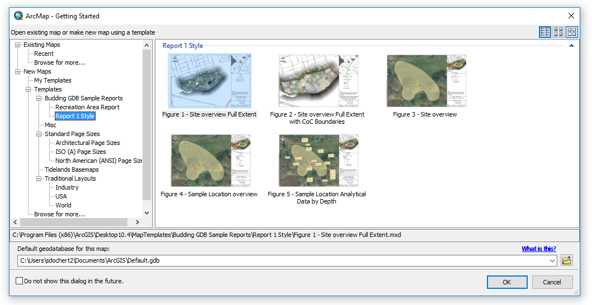

We will start by bringing in the figure extent feature class that was created above and use the [Extent to polygon](./Useful_tools) tool to extract the footprint of the data frame layout.  These polygons will be used to 
store the layout extent of the figure as well extracting items of interest.

In this particular example, we will be creating boundary extents to filter out sample locations that fall outside the boundary as we mainly want to focus in on the locations on the inside.

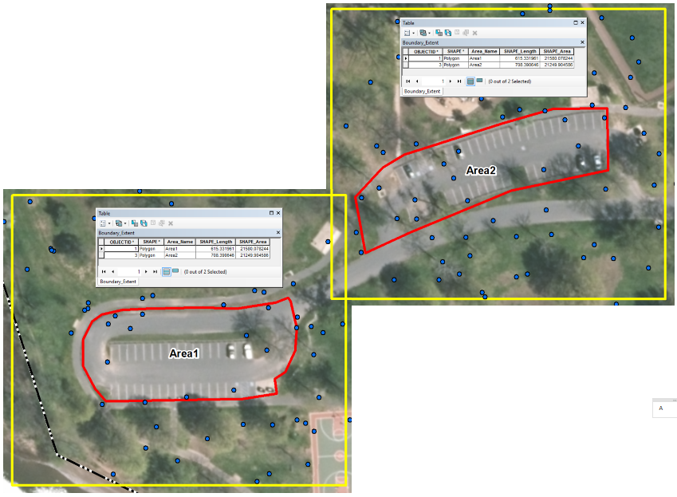

Now that we have the figure and boundary extents all set up, lets add the sample locations to our report feature class.  This can easily be done by running the [add new geometry](https://github.com/SethDocherty/Budding-GDB/#add-new-geometry) tool.  
and then adding the new features that were found to the report specific feature class. This tool acts as the replicator that goes through each figure and adds new features from the parent feature class that are not in the figure. 
One of the neat features with this tool is that the replicated feature class inherits the attributes of the figure that it intersects.

At this point you can set up the label classes and create feature linked annotation. Keep in mind, text placement is scale specific.  The label size at one scale will be different for another scale.  Calculating the label sizes
at different scales is just a matter of fractions; See [The font size calculator](./Ref_Docs) to help find the necessary font sizes.

The features have been added your figure and all that needs to be done is to access the template created -> zoom to figure of interest -> press print.  If the figure needs to be updated with the latest set of sample locations, all you need 
to do is run the add new geometry tool again and it add the new locations to the figure and re-printing the PDF.

## Installation and Other Files

All the geo-processing scripts have conveniently been bundled into an ArcGIS Add-in.  To install, download the [add-in](https://github.com/SethDocherty/Budding-GDB/raw/master/Budding_GDB_toolset/Budding_GDB_toolset.esriaddin) and
double click the file.  Once installed you can add the toolbar by going to customize -> Toolbars -> Budding GDB Toolset.

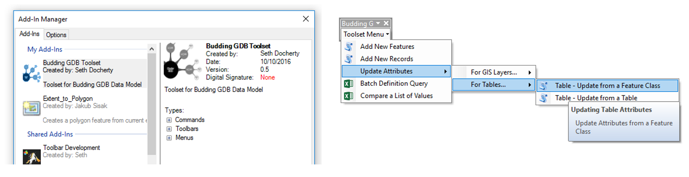

#### Other files 

Files that may be of interest for the map creation process include:
 
 - [The font size calculator](./Ref_Docs): This is useful when creating annotation classes for feature linked annotation as text placement is scale specific.  Font size at 1:360 will be completely different when the scale is 1:900.  See [here](http://gis.stackexchange.com/questions/94356/uniform-annotation-font-size-in-multiple-data-frames)
 for more info
 - [Extent to polygon](./Useful_tools): This add-in is incredibly useful in converting the footprint of your data frame to a polygon.  More info found [here](http://www.arcgis.com/home/item.html?id=a9b032f739254ebeb6221c9294ebc886#!)
 - [Sample Dataset](./Sample_Data):  I've provided a sample dataset for testing so you can quickly try out the tools. 
 - [Budding GDB Data Model](https://github.com/SethDocherty/Budding-GDB/raw/master/Ref%20Docs/Budding%20GDB%20Data%20Model.pptx): Presentation I gave on the Budding GDB data model presented at the [2016 MACURISA Conference](https://macurisa2016.sched.org/)
 
#### Contact
 
Feel free to reach out to me by [email](mailto:sddocherty@gmail.com) for more info about the data model and if you find any bugs, please open up an issue in the repository.
